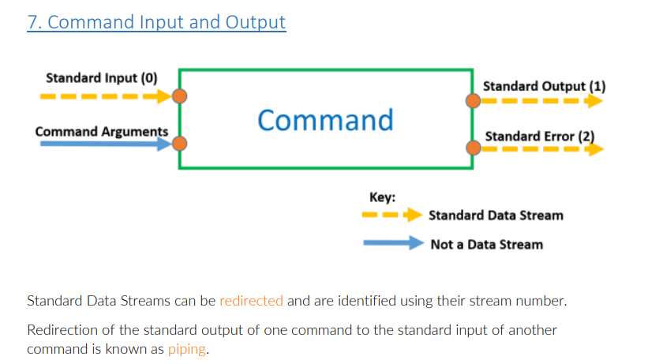
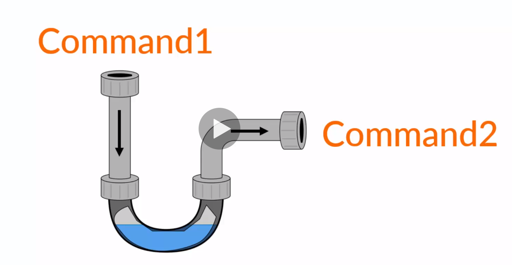
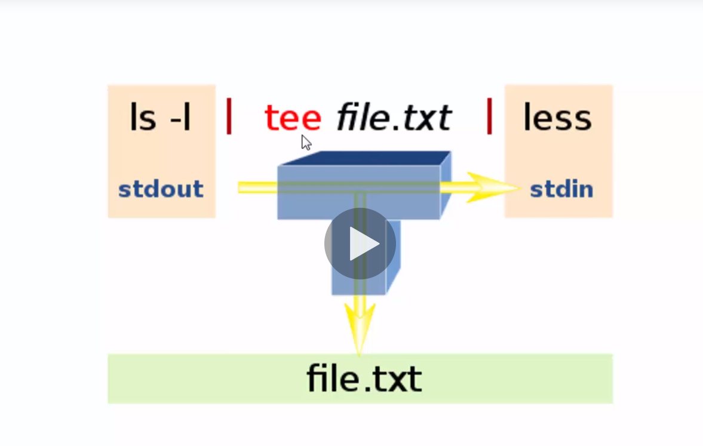

# Linux Terminal Fundamentals 🚀🚀🚀🚀🚀

- `echo helooooooo` = Will echo our **helooooo**

- `cal`
  June 2021
  Su Mo Tu We Th Fr Sa
  1 2 3 4 5
  6 7 8 9 10 11 12
  13 14 15 16 17 18 19
  20 21 22 23 24 25 26
  27 28 29 30

- `cal 2017` = print all months of 2017

We can Also Give commands cutomize commands with

- `cal -y` = print all months of current year

SO there are two ways , we can give options or input.

- `date` = using this we can se todays Date

- `clear` = to clean command (keyboard shotcut is ctrl + L)

- using arrow key we can see the past commands we have written

- we can also use `history` command to see all past commands we have executed

- we can use `!(a number here)` to go to that particular old command

- `!!` to run the latest command

- `history -c;history -w;` To clear the history and write the changes to that history

- `exit` or ctrl+d to close the terminal

## Commands vs shell

- Commands are just text but when we hit enter in terminal then it is executed as shell

- Commands(words) -> the shell -> Meaning

- shell is used to get the meaning of that word.

- The meaning can be different depending on the shell.

- commands are interpreted by the shell

- commands are case sensitive

## Terminal

- it is a window to the shell.

- Here we can type commands in terminal and then when we hit enter then its submitted to the shell.

- The most common shell is bash shell

- Ubuntu and most linux uses bash shell.

## Understanding Command Structure

- All commands is the program stored in the computer.

- Each command has its unique behaviour

- General Structure of commands is `commandName options inputs`

- Then search will search this in path which is the folder which contains list of all these programs to run.

- We can see that program using `echo $PATH`

- All folders are differentiated by `:` in the result

- The shell will search linearly from left to right folders for the program we want to run until we get right folder.

- If we try to run something which is not there in the folder then it will tell `command not found`

- to know which folder is the command in is `which cal`

- to know where is which command is `which which` 🤣

- we can customize commands by giving them different options and different inputs.

- Not all command require Inputs,but most commands require input which is called as operand

eg. `cal 2017`

- Here 2017 is the input, also we can give more input

eg. `cal 12 2017` - this will give calendar gor 2017 december

- Now Coming to **options** 

- `cal -y` here y is an option

- we can also use multiple options `command -a -b -c`

- Even we can chain them `command -abc`
- The options can be in longer as well but if we are using longer options then we need to use `date --universal` rather than `date -u`
- The small form is also not available for everyone
- we cant chain the long form of the options but we can chain the shor form.
- `cal -A 1 12 2017` - here the 1 is the input for the option A which tells the give one moth calender till after.

## Using The Linux Manual

[*Manual Structure Cheat Sheet*](Manual+Structure+Cheat+Sheet.pdf)

- To search for the manaul `man -k searchterm` 
- Here k is telling to search for some terms  

[Command Synopsis Cheat Sheet](Command+Synopsis+Cheat+Sheet.pdf)

## Command Input And Output

- standard input is connected to the keyboard by default 
- standard output and error is connected to the terminal by default

## Redirection

- allow us to move data around commands
- by defaut lets use the cat command.
- Now by default its standard input is keyboard and ouput is terminal.
- now we want to redirect its destination.
- `cat 1> output.txt` 
- standard output is the name of the stream that data goes down.
- it also has number assocoated with it.
- standard input = 0
- standard output = 1
- standard error = 2
- Here we are changng the destination of 1 i.e standard output and pointing it to output.txt
- Now it we run this command `cat 1> output.txt`, then it will take the inputs but will not return us the ouput to terminal but it will store it in the output.txt file.
- `cat > output.txt` = this is a shotcut to do the same
- `cat 1>> output.txt` = this will not truncate the old text in that file
- we can also use `cat >> output.txt`
- Now coming to standard error and standard input
- standard error is same as standard output just the number is different.
- `cat 2>> output.txt` - without truncation
- `cat -k bla 2>> error.txt` - this is mostly used by the web servers
- we can do both same time 
- `cat 1>> output.txt 2>> error.txt`
- Now coming to shandard input so we take a text file called **input.txt**
- `cat 0< input.txt` - this will output the content of input.txt
- we can also use `cat < input.txt`
- `cat 0< input.txt 1> hello.txt`
- Everything in linux is considered as a file only even the terminal
- `tty` gives the location of the terminal
- so we can even write something to the terminal as well from another terminal
- `cat 0< input.txt > /dev/pts/1`

## Piping 

- This piping is really powerful
- `date`
- `date 1> date.txt`
- `cut < date.txt --delimeter " " --fields 1`  = > Mon
- So this works right we were able to cut the Mon from the date but it looks clunky.
- here there is no need to have some extra file and its enefficient.
- so we can use piping
- `date | cut --delimeter " " --fields 1`
- This works in just one step, here we take date output and pass it to cut. Even we can write this data to a file as well.
- `date | cut --delimeter " " --fields 1 > todat.txt`
- We can even use all options as well.
- we can use multiple chain of piping.

### tee and xargs Commands

- We can pass data to two pipes
-  `date | tee fulldate.txt |cut --delimeter " " --fields 1`
-  Here we will get Mon in terminal and also a fulldate.txt file will be also created with the current date stored.

- some commands dont accept standard input but accept command line arguments.
- eg `date | echo` would not return anything as echo dosent take any standard input but it only accepts command line arguments
- so we have to convert input to command line arguments
- `date | xargs echo` = this will echo out the date
- `date | xargs echo "hello"`  - this will echo hello first and then date but will echo both.

## Aliases

- NickNames for Pipelines
- save a file with name `.bash_aliases` and save it.
- this `.` makes file a hidden file.
- Now in the file we can write `date | tee /home/shaksham/fulldate.txt | cut --delimiter=" " --field=1 | tee /home/shaksham/fulldate.txt | xargs echo hello`
- this is a hell lot long Pipeline
- Now for alias `alias getdates='date | tee /home/shaksham/fulldate.txt | cut --delimiter=" " --field=1 | tee /home/shaksham/fulldate.txt | xargs echo hello'`
- Now we can use `getdates` command in out **terminal**.

# Complete Reference Pdf

[PDF](Section+2+Command+Cheat+Sheet.pdf)
