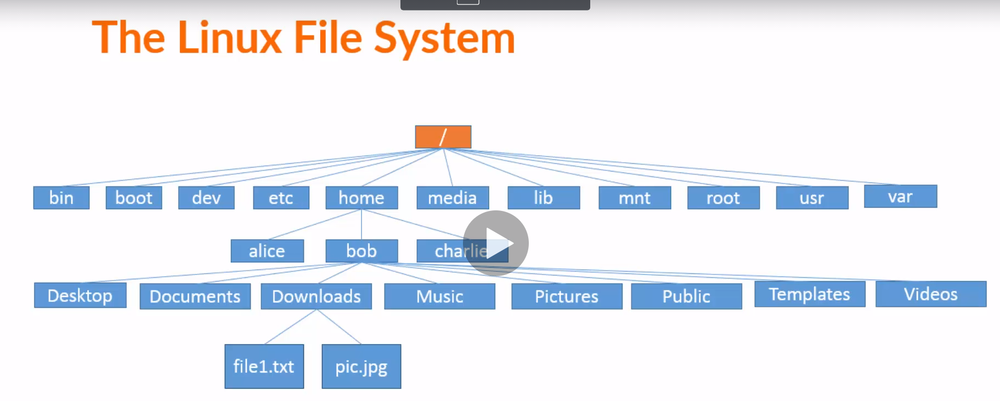

# File System 

Some other resources are :- 
[Understanding UNIX / Linux File Systems](https://www.cyberciti.biz/tips/understanding-unixlinux-file-system-part-i.html)

- Entire Linux Follow Tree Stucture
- on top we have **root** directory `/`
- 
- Every FIle can be traced back to root directory
- One of the important directory here is home directory which contains the user and then user contains everything for that user eg , documents , desktop etc.
- [cheat sheet](File+System+Cheat+Sheet.pdf)
- this cheat explains all the Directory and why they are use.

## pwd and ls command

- shaksham@computerName:~$ => ~ tells we are in home directory  
- `pwd` tells the `**current Working Directory**
- `ls` -> it takes everything as command line arguments
- it list out the contents of the current directory or even we can giive command line arguments to give the list of a particular directory.
- `ls -F` -> it tells the different files and folders
- `ls -l` -> list in long form 
- `ls -l -h` => human redable form
- first is the directory(- for the file) and then three are read write and execute 
- `ls -a` shows whole file even the hidden one

## cd command

- `cd` command is for the change directory
- `cd` command is to go back the current users home directory
- `cd .` here dot refers to the current folder
- `cd ..` it tells above directory from where we are

## File Extensions in Linux

- `file` command tells the type of file we want to no.
- `file tuf.png` will tell about that file, here that its a png file.

## WildCards

- `ls Documents/ Downloads/ Pictures/` - it tells to show files from all folders
- `ls *` - Here star tells to look for everything so here it will show contents of all the folder inside the cwd
- Here This * is a regular expression
- `ls D*` - list out anything has D in start and then anything.
- `ls Do*`
- some resources on wildcards
- [Wildcards](https://tldp.org/LDP/GNU-Linux-Tools-Summary/html/x11655.htm)
- [Wildcards](http://www.linfo.org/wildcard.html)
- **?** wildcard will only match one character
- `ls ?.pdf` will only match to a.pdf or b.bdf etc
- **[]** - `ls file[1234567890].txt` - will give only file which has 1 or 2 or 3....
-  `ls file[0-9].pdf`
-  `ls file[a-z].pdf`
-  `ls file[0-9][0-90].pdf` - will look for two numbers
- `ls file[0-9][A-Z][a-z].txt`
- `ls file[0-9abc].txt`
  
## touch and mkdir command

- `touch` command creates new file
- `touch file1`
- `echo "hello" > hello.txt`
- `mkdir` - it shands for make directory
- `mkdir folder`
- `mkdir blah/thing/shaksham` it wil give error but e can use `mkdir -p blah/thing/shaksham`
- `mkdir "happy birthday"` - but try to avoid spaced and use _
- Now we want to create a lot of folders
- `mkdir {jan,feb,mar,apr......,dec}_{2017,2018,.....2022}` - it will expand how brackects expand
- `mkdir {jan,feb,mar,apr......,dec}_{2017..2022}` 
- `touch {jan,feb,mar,apr......,dec}_{2017..2022}/file{1,100}`  - in each folder create file 1 to 100
- even this can be used with `ls` command
- `touch file{A..C}.txt`
- `touch file{A,B,C}.txt`